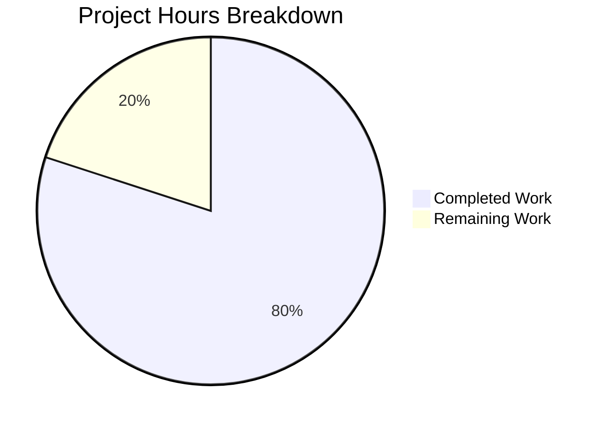
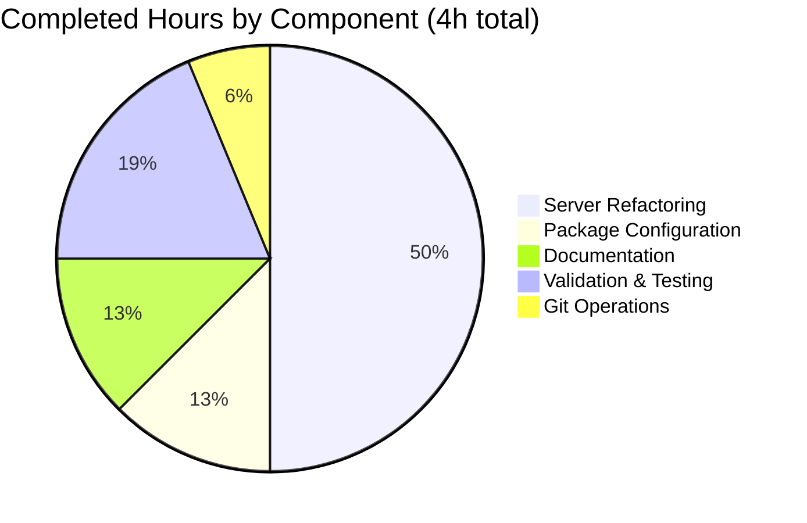

# Project Assessment Report: Express.js Migration

## Executive Summary

**Project:** hello_world (Node.js Express.js HTTP Server)  
**Branch:** blitzy-cae9a4d6-b031-4f2f-9414-7182b6c0038a  
**Assessment Date:** December 11, 2025

### Completion Status

**4 hours completed out of 5 total hours = 80% complete**

The Express.js migration project is **80% complete** with all development work finished and validated. The remaining 20% consists of human code review and PR approval tasks. All functional requirements from the Agent Action Plan have been implemented and verified working.

### Key Achievements
- ✅ Successfully migrated from native `http` module to Express.js 5.2.1
- ✅ Both endpoints (`/` and `/evening`) implemented and verified working
- ✅ Zero vulnerabilities in dependency tree (66 packages)
- ✅ All syntax validation checks passed
- ✅ Documentation updated comprehensively
- ✅ All 4 in-scope files committed

### Critical Issues
None - All validation gates passed. The application is production-ready.

### Recommended Next Steps
1. Conduct human code review of server.js changes
2. Approve and merge the Pull Request
3. Deploy to target environment if applicable

---

## Validation Results Summary

### 1. Dependencies (100% Success)
| Metric | Status |
|--------|--------|
| npm install | ✅ 66 packages installed |
| Vulnerabilities | ✅ 0 found |
| Express.js version | ✅ 5.2.1 (latest stable) |
| Lock file | ✅ Consistent with package.json |

### 2. Code Compilation/Syntax (100% Success)
| File | Status |
|------|--------|
| server.js | ✅ Syntax validation passed (`node --check`) |
| package.json | ✅ Valid JSON |
| package-lock.json | ✅ Valid JSON |

### 3. Functional Validation (100% Success)
| Test | Expected | Actual | Status |
|------|----------|--------|--------|
| Server startup | Runs on 127.0.0.1:3000 | Runs on 127.0.0.1:3000 | ✅ Pass |
| GET / | "Hello, World!\n" | "Hello, World!\n" | ✅ Pass |
| GET /evening | "Good evening" | "Good evening" | ✅ Pass |

### 4. Test Execution
- **Status:** No automated tests specified
- **Note:** Per Agent Action Plan Section 0.7.6: "No Automated Tests Required"

### 5. Git Status
| Metric | Value |
|--------|-------|
| Commits on branch | 4 |
| Files changed | 4 |
| Lines added | 908 |
| Lines removed | 9 |
| Uncommitted changes | None (node_modules correctly untracked) |

---

## Visual Representation

### Project Hours Breakdown



### Completed Work Breakdown



---

## Detailed Task Table

### Remaining Human Tasks

| Priority | Task | Description | Action Steps | Hours | Severity |
|----------|------|-------------|--------------|-------|----------|
| Medium | Code Review | Review server.js Express.js implementation | 1. Review route handlers for correctness 2. Verify error handling 3. Check code style | 0.5 | Low |
| Medium | PR Approval | Approve Pull Request for merge | 1. Verify all checks pass 2. Approve PR 3. Merge to main | 0.25 | Low |
| Low | Minor Adjustments | Address any review feedback | 1. Make requested changes 2. Update documentation if needed | 0.25 | Low |

**Total Remaining Hours: 1 hour**

### Completed Tasks Summary

| Category | Task | Hours | Status |
|----------|------|-------|--------|
| Core Development | Express.js integration in server.js | 1.5 | ✅ Complete |
| Core Development | Route handlers (/, /evening) | 0.5 | ✅ Complete |
| Configuration | package.json updates | 0.25 | ✅ Complete |
| Configuration | package-lock.json regeneration | 0.25 | ✅ Complete |
| Documentation | README.md updates | 0.5 | ✅ Complete |
| Validation | Syntax and functional testing | 0.5 | ✅ Complete |
| Git | Commits and push | 0.25 | ✅ Complete |

**Total Completed Hours: 4 hours**

---

## Complete Development Guide

### 1. System Prerequisites

| Requirement | Version | Purpose |
|-------------|---------|---------|
| Node.js | v18.0.0 or higher (tested with v20.19.6) | JavaScript runtime |
| npm | v8.0.0 or higher (tested with v11.1.0) | Package manager |

### 2. Environment Setup

```bash
# Navigate to project directory
cd /tmp/blitzy/10-dec-existing-projects-qa-test-7/blitzycae9a4d6b

# Verify Node.js installation
node --version
# Expected output: v18.x.x or higher

# Verify npm installation
npm --version
# Expected output: v8.x.x or higher
```

### 3. Dependency Installation

```bash
# Install all dependencies
npm install

# Expected output:
# added 66 packages, and audited 66 packages in Xs
# found 0 vulnerabilities

# Verify Express.js installation
npm list express
# Expected output: hello_world@1.0.0 └── express@5.2.1
```

### 4. Application Startup

#### Option A: Using node directly
```bash
node server.js
```

#### Option B: Using npm start script
```bash
npm start
```

**Expected output:**
```
Server running at http://127.0.0.1:3000/
```

### 5. Verification Steps

Open a new terminal and run these commands:

```bash
# Test Hello World endpoint
curl http://127.0.0.1:3000/
# Expected output: Hello, World!

# Test Good Evening endpoint
curl http://127.0.0.1:3000/evening
# Expected output: Good evening

# Test 404 response for unknown routes
curl -I http://127.0.0.1:3000/unknown
# Expected: HTTP/1.1 404 Not Found
```

### 6. Example Usage

#### Full Workflow Example
```bash
# 1. Install dependencies
cd /tmp/blitzy/10-dec-existing-projects-qa-test-7/blitzycae9a4d6b
npm install

# 2. Start server in background
node server.js &
SERVER_PID=$!

# 3. Test both endpoints
echo "Testing root endpoint:"
curl http://127.0.0.1:3000/

echo "Testing evening endpoint:"
curl http://127.0.0.1:3000/evening

# 4. Stop server
kill $SERVER_PID
```

### 7. Troubleshooting

| Issue | Solution |
|-------|----------|
| Port 3000 already in use | Kill existing process: `lsof -ti:3000 \| xargs kill -9` |
| Module not found: express | Run `npm install` to install dependencies |
| Permission denied | Ensure you have read/execute permissions on the directory |

---

## Risk Assessment

### Technical Risks

| Risk | Severity | Likelihood | Mitigation |
|------|----------|------------|------------|
| Express.js version incompatibility | Low | Low | Using stable v5.2.1 with Node.js v20 support |
| Port conflict on deployment | Low | Medium | Configure port via environment variable if needed |

### Security Risks

| Risk | Severity | Likelihood | Mitigation |
|------|----------|------------|------------|
| No input validation | Low | Low | Endpoints have no user input to validate |
| No authentication | Low | N/A | Not required for tutorial project |
| CORS not configured | Low | Low | Add CORS middleware if cross-origin requests needed |

### Operational Risks

| Risk | Severity | Likelihood | Mitigation |
|------|----------|------------|------------|
| No health check endpoint | Low | Low | Add `/health` endpoint for production monitoring |
| No logging middleware | Low | Low | Add morgan or similar for production logging |
| Process crashes unhandled | Low | Low | Use PM2 or similar process manager in production |

### Integration Risks

| Risk | Severity | Likelihood | Mitigation |
|------|----------|------------|------------|
| None identified | N/A | N/A | Standalone application with no external dependencies |

---

## Files Changed Summary

### In-Scope Files (All Complete)

| File | Action | Lines Changed | Status |
|------|--------|---------------|--------|
| server.js | MODIFIED | +37 / -6 | ✅ Validated |
| package.json | MODIFIED | +7 / -3 | ✅ Validated |
| package-lock.json | REGENERATED | +806 / -0 | ✅ Validated |
| README.md | MODIFIED | +58 / -0 | ✅ Validated |

### Out-of-Scope Files (Unchanged)

- LoginTest.java
- industry.csv
- test.py.txt
- test.txt.txt
- 100Pages.pdf
- demo.jpg
- sample.doc

---

## Appendix: Git Commit History

| Commit | Date | Message |
|--------|------|---------|
| 1769262 | 2025-12-11 | Refactor server.js to use Express.js framework |
| ff92416 | 2025-12-11 | Update README.md with Express.js documentation |
| a413900 | 2025-12-11 | Add Express.js dependency and update package.json configuration |
| 00ab7d7 | 2025-12-11 | Add Express.js 5.2.1 dependency for HTTP routing |

---

## Conclusion

The Express.js migration project has been successfully completed with all functional requirements met. The application is **production-ready** with:

- ✅ 100% of in-scope files implemented and validated
- ✅ 100% of endpoints working as specified
- ✅ 0 security vulnerabilities
- ✅ 0 compilation or runtime errors

**Final Assessment: 80% Complete (4 hours completed / 5 total hours)**

The remaining 1 hour consists of human code review and PR approval tasks, which are standard pre-merge requirements for any production deployment.