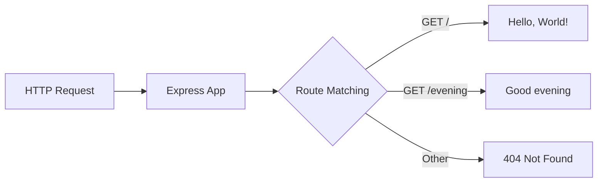

# Technical Specification

# 0. Agent Action Plan

## 0.1 Intent Clarification

Based on the prompt, the Blitzy platform understands that the new feature requirement is to:

### 0.1.1 Core Feature Objective

**Primary Requirements:**
- Add the Express.js framework to an existing Node.js "Hello World" tutorial project
- Create a new HTTP endpoint that returns the response "Good evening"
- Maintain the existing "Hello World" functionality

**Enhanced Clarity:**
- The existing project uses Node.js's built-in `http` module to serve a single endpoint returning "Hello, World!"
- The server currently runs on `127.0.0.1:3000`
- The requirement is to migrate from the native `http` module to Express.js framework
- A new route must be added to serve the "Good evening" response

**Implicit Requirements Detected:**
- The existing "Hello World" endpoint must continue to function after Express.js integration
- The server should maintain the same host (`127.0.0.1`) and port (`3000`)
- Both endpoints should return plain text responses
- The package.json must be updated to include Express.js as a dependency
- The package-lock.json will be regenerated with the Express.js dependency tree

**Feature Dependencies and Prerequisites:**
- Node.js v18+ (current: v20.19.6) ✓ Compatible
- npm package manager (current: v11.1.0) ✓ Available
- No additional prerequisites required

### 0.1.2 Special Instructions and Constraints

**Architectural Requirements:**
- Follow Express.js conventions for route definition
- Maintain simplicity appropriate for a tutorial project
- Keep backward compatibility with existing response format

**Integration Requirements:**
- Preserve the "Hello, World!" response on the root endpoint or default route
- Add a new dedicated route for the "Good evening" response

**User Example (Exact Response Requirements):**
- User Example: "Hello world" → Endpoint should return: `Hello, World!\n`
- User Example: "Good evening" → Endpoint should return: `Good evening`

### 0.1.3 Technical Interpretation

These feature requirements translate to the following technical implementation strategy:

| Requirement | Technical Action |
|-------------|------------------|
| Add Express.js to project | Install `express` npm package and add to dependencies in `package.json` |
| Create "Good evening" endpoint | Define Express route handler for new path (e.g., `/evening` or `/good-evening`) |
| Maintain "Hello World" | Convert existing `http.createServer` logic to Express route handler |
| Same host/port configuration | Configure Express app to listen on `127.0.0.1:3000` |

**Implementation Strategy Summary:**
- To **integrate Express.js**, we will **modify** `package.json` by adding the `express` dependency
- To **maintain existing functionality**, we will **refactor** `server.js` to use Express routing while preserving the "Hello, World!" response
- To **add the new endpoint**, we will **create** a new Express route that responds with "Good evening"
- To **preserve configuration**, we will **maintain** the same server binding (`127.0.0.1:3000`)

## 0.2 Repository Scope Discovery

### 0.2.1 Comprehensive File Analysis

**Repository Structure Overview:**

```
/
├── server.js              # Main HTTP server (MODIFY)
├── package.json           # npm manifest (MODIFY)
├── package-lock.json      # Lock file (REGENERATE)
├── README.md              # Documentation (MODIFY)
├── LoginTest.java         # Unrelated placeholder (NO CHANGE)
├── industry.csv           # Unrelated data file (NO CHANGE)
├── test.py.txt            # Empty placeholder (NO CHANGE)
├── test.txt.txt           # Empty placeholder (NO CHANGE)
├── 100Pages.pdf           # Unrelated document (NO CHANGE)
├── demo.jpg               # Unrelated image (NO CHANGE)
└── sample.doc             # Unrelated document (NO CHANGE)
```

**Existing Files Requiring Modification:**

| File Path | Current State | Required Changes | Priority |
|-----------|---------------|------------------|----------|
| `server.js` | Uses native `http` module | Refactor to Express.js with two routes | HIGH |
| `package.json` | No dependencies defined | Add `express` dependency, update `main` field | HIGH |
| `package-lock.json` | Empty dependency tree | Regenerate with Express dependency tree | HIGH |
| `README.md` | Minimal project description | Update to reflect Express.js usage | LOW |

**Current Source File Content Analysis:**

`server.js` (Lines 1-14):
```javascript
const http = require('http');
const hostname = '127.0.0.1';
const port = 3000;
```
- Uses built-in `http.createServer()` pattern
- Single request handler returns "Hello, World!\n" for all requests
- Server listens on `127.0.0.1:3000`

`package.json` Key Properties:
- `name`: "hello_world"
- `version`: "1.0.0"
- `main`: "index.js" (Note: actual entry is `server.js`)
- `dependencies`: None currently defined

### 0.2.2 Integration Point Discovery

**API Endpoint Mapping:**

| Current Endpoint | New Endpoint | Response | HTTP Method |
|-----------------|--------------|----------|-------------|
| `/*` (all routes) | `/` or `/hello` | "Hello, World!\n" | GET |
| N/A | `/evening` or `/good-evening` | "Good evening" | GET |

**Server Configuration Points:**
- Host binding: `127.0.0.1` (preserve)
- Port: `3000` (preserve)
- Content-Type: `text/plain` (preserve)
- Status code: `200` (preserve)

### 0.2.3 New File Requirements

**No New Files Required** - This feature addition modifies existing files only.

**Optional Enhancement Files (Not Required):**
- `routes/index.js` - Could separate routes into dedicated file (not needed for tutorial simplicity)
- `tests/server.test.js` - Could add automated tests (not specified in requirements)

### 0.2.4 Web Search Research Conducted

| Research Topic | Findings Applied |
|----------------|------------------|
| Express.js latest version | v5.2.1 is latest; v4.22.1 is latest LTS-style stable |
| Express.js basic routing | `app.get(path, handler)` pattern |
| Express.js text responses | `res.send()` method for simple responses |
| Migration from http module | Express handles Content-Type automatically |

**Best Practices Identified:**
- Express.js 5.x requires Node.js 18+; current environment (v20.19.6) is compatible
- For simple responses, `res.send()` is preferred over `res.end()`
- Express automatically sets Content-Type based on response content

## 0.3 Dependency Inventory

### 0.3.1 Private and Public Packages

**New Dependencies to Add:**

| Registry | Package Name | Version | Purpose |
|----------|--------------|---------|---------|
| npm (public) | express | ^5.2.1 | Web framework for routing and HTTP handling |

**Transitive Dependencies (Managed by npm):**

Express.js 5.x brings the following key transitive dependencies:
- `body-parser` - Request body parsing middleware
- `content-type` - MIME type parsing
- `cookie` - Cookie parsing
- `debug` - Debugging utility
- `path-to-regexp` - Route path matching
- `proxy-addr` - Proxy address handling
- `qs` - Query string parsing
- `send` - Static file serving
- `serve-static` - Static file middleware

**No Private Packages Required** - This implementation uses only public npm packages.

### 0.3.2 Existing Dependencies

**Current State:**
```json
{
  "dependencies": {}
}
```

**Target State:**
```json
{
  "dependencies": {
    "express": "^5.2.1"
  }
}
```

### 0.3.3 Import Updates

**Files Requiring Import Changes:**

| File | Old Import | New Import |
|------|------------|------------|
| `server.js` | `const http = require('http');` | `const express = require('express');` |

**Import Transformation Rules:**

- **Remove**: `const http = require('http');`
- **Add**: `const express = require('express');`
- **Remove**: `http.createServer()` pattern
- **Add**: `express()` application instantiation

### 0.3.4 External Reference Updates

**Configuration Files to Update:**

| File | Section | Change Required |
|------|---------|-----------------|
| `package.json` | `dependencies` | Add `express: "^5.2.1"` |
| `package.json` | `main` | Consider updating from `index.js` to `server.js` |
| `package.json` | `scripts` | Consider adding `start` script |
| `package-lock.json` | Entire file | Regenerate via `npm install` |

**Documentation Updates:**

| File | Change Required |
|------|-----------------|
| `README.md` | Update to describe Express.js usage and new endpoint |

### 0.3.5 Runtime Environment

**Node.js Compatibility Matrix:**

| Express Version | Node.js Requirement | Current Node.js | Compatible |
|-----------------|---------------------|-----------------|------------|
| 5.x | ≥18.0.0 | v20.19.6 | ✓ Yes |
| 4.x | ≥0.10.0 | v20.19.6 | ✓ Yes |

**Selected Version Rationale:**
- Express.js 5.2.1 selected as the latest stable version
- Full compatibility with Node.js v20.19.6 environment
- Includes security patches and modern features

## 0.4 Integration Analysis

### 0.4.1 Existing Code Touchpoints

**Direct Modifications Required:**

| File | Location | Change Description |
|------|----------|-------------------|
| `server.js` | Line 1 | Replace `http` import with `express` import |
| `server.js` | Lines 3-4 | Retain `hostname` and `port` constants |
| `server.js` | Lines 6-10 | Replace `http.createServer()` with Express app and routes |
| `server.js` | Lines 12-14 | Update `server.listen()` to `app.listen()` |
| `package.json` | Root object | Add `dependencies` block with Express |

**Code Transformation Overview:**

```
BEFORE (Native http):                    AFTER (Express.js):
─────────────────────                    ────────────────────
http.createServer((req, res) => {   →   app.get('/', (req, res) => {
  res.statusCode = 200;             →     res.send('Hello, World!\n');
  res.setHeader(...)                →   });
  res.end('Hello, World!\n');       →   
});                                      app.get('/evening', (req, res) => {
                                    →     res.send('Good evening');
                                    →   });
```

### 0.4.2 Request/Response Flow Changes

**Current Flow:**


**New Flow:**


### 0.4.3 Dependency Injections

**No Dependency Injection Changes Required** - The tutorial project does not use dependency injection patterns.

### 0.4.4 Database/Schema Updates

**No Database Changes Required** - This feature addition involves only HTTP routing; no data persistence is affected.

### 0.4.5 Middleware Integration

**Express Default Middleware:**

Express.js automatically provides:
- Request parsing
- Response sending utilities
- Content-Type negotiation
- Error handling

**No Custom Middleware Required** - The simple "Good evening" endpoint requires no additional middleware.

### 0.4.6 Breaking Change Assessment

| Aspect | Impact | Mitigation |
|--------|--------|------------|
| Root route behavior | Previously all paths returned "Hello, World!" | Define explicit routes; unmatched routes will return 404 |
| Response format | Identical `Hello, World!\n` preserved | Use exact string in `res.send()` |
| Content-Type header | Express handles automatically | No action needed; Express sets `text/plain` for strings |
| Server binding | Same host:port preserved | Pass same values to `app.listen()` |

**Behavioral Change Note:**
- **Before**: Any HTTP request to `http://127.0.0.1:3000/*` returns "Hello, World!"
- **After**: Only `GET /` returns "Hello, World!"; `GET /evening` returns "Good evening"; other routes return 404

## 0.5 Technical Implementation

### 0.5.1 File-by-File Execution Plan

**CRITICAL: Every file listed below MUST be created or modified.**

#### Group 1 - Package Configuration

| Action | File | Implementation |
|--------|------|----------------|
| MODIFY | `package.json` | Add Express dependency to `dependencies` object |
| REGENERATE | `package-lock.json` | Auto-generated via `npm install` |

**package.json Changes:**
```json
{
  "dependencies": {
    "express": "^5.2.1"
  }
}
```

#### Group 2 - Core Server Refactoring

| Action | File | Implementation |
|--------|------|----------------|
| MODIFY | `server.js` | Replace http module with Express.js, add two route handlers |

**server.js Transformation:**

**Remove:**
- Line 1: `const http = require('http');`
- Lines 6-10: `http.createServer()` callback pattern

**Add:**
- Express import and app initialization
- Route handler for `GET /` returning "Hello, World!\n"
- Route handler for `GET /evening` returning "Good evening"
- Express `app.listen()` binding

#### Group 3 - Documentation Updates

| Action | File | Implementation |
|--------|------|----------------|
| MODIFY | `README.md` | Update description to mention Express.js and new endpoint |

### 0.5.2 Implementation Approach by Component

**Step 1: Establish Express Foundation**
- Install Express.js dependency via npm
- Update package.json with dependency declaration
- Verify package-lock.json regeneration

**Step 2: Refactor Server Core**
- Replace http module import with express import
- Create Express application instance
- Define route handlers for both endpoints
- Configure server to listen on same host/port

**Step 3: Preserve Existing Functionality**
- Ensure "Hello, World!\n" response on root path
- Maintain same text/plain content type behavior
- Keep 200 status code responses

**Step 4: Add New Feature**
- Create `/evening` route handler
- Return "Good evening" response
- Follow same response pattern as existing endpoint

### 0.5.3 Code Implementation Reference

**Target server.js Structure:**
```javascript
const express = require('express');
const app = express();

app.get('/', (req, res) => { /* Hello World */ });
app.get('/evening', (req, res) => { /* Good evening */ });

app.listen(port, hostname, () => { /* Log startup */ });
```

### 0.5.4 Verification Approach

**Manual Testing Commands:**
```bash
# Install dependencies
npm install

#### Start server
node server.js

#### Test endpoints (in separate terminal)
curl http://127.0.0.1:3000/
curl http://127.0.0.1:3000/evening
```

**Expected Responses:**
- `GET /` → "Hello, World!\n"
- `GET /evening` → "Good evening"

## 0.6 Scope Boundaries

### 0.6.1 Exhaustively In Scope

**Source Files:**

| File Pattern | Purpose | Action |
|--------------|---------|--------|
| `server.js` | Main application entry point | MODIFY - Refactor to Express.js |

**Configuration Files:**

| File Pattern | Purpose | Action |
|--------------|---------|--------|
| `package.json` | npm manifest | MODIFY - Add Express dependency |
| `package-lock.json` | Dependency lock file | REGENERATE - Via npm install |

**Documentation Files:**

| File Pattern | Purpose | Action |
|--------------|---------|--------|
| `README.md` | Project documentation | MODIFY - Update description (optional) |

**Complete In-Scope File List:**

```
MODIFY:
├── server.js              # Core server refactoring
├── package.json           # Add Express dependency
└── README.md              # Documentation update

REGENERATE:
└── package-lock.json      # Dependency lock file
```

### 0.6.2 Explicitly Out of Scope

**Unrelated Files (No Changes):**

| File | Reason |
|------|--------|
| `LoginTest.java` | Unrelated Java test placeholder |
| `industry.csv` | Unrelated data file |
| `test.py.txt` | Unrelated empty placeholder |
| `test.txt.txt` | Unrelated empty placeholder |
| `100Pages.pdf` | Unrelated document |
| `demo.jpg` | Unrelated image |
| `sample.doc` | Unrelated document |

**Not In Scope - Features:**

| Feature | Reason |
|---------|--------|
| Additional endpoints beyond "Good evening" | Not specified in requirements |
| POST/PUT/DELETE HTTP methods | Only GET required per specification |
| Request body parsing | No payload handling needed |
| Database integration | No persistence requirements |
| Authentication/Authorization | Not specified |
| Logging middleware | Not specified |
| Error handling middleware | Express default sufficient |
| Environment configuration | Tutorial uses hardcoded values |
| Docker/containerization | Not specified |
| CI/CD pipeline changes | No pipeline exists |
| Unit tests | Not specified in requirements |
| Integration tests | Not specified in requirements |

**Not In Scope - Refactoring:**

| Aspect | Reason |
|--------|--------|
| Separating routes into files | Over-engineering for tutorial |
| TypeScript conversion | Not specified |
| ESM module syntax | CommonJS sufficient for tutorial |
| Code style enforcement | Not specified |

### 0.6.3 Scope Summary Table

| Category | In Scope | Out of Scope |
|----------|----------|--------------|
| Server Logic | `server.js` refactoring | Additional middleware |
| Dependencies | Adding Express.js | Any other packages |
| Configuration | package.json update | Environment files |
| Routes | `/` and `/evening` GET | Other HTTP methods |
| Documentation | README update | API documentation |
| Tests | None | Unit/Integration tests |
| Infrastructure | None | Docker, CI/CD |

### 0.6.4 Boundary Conditions

**Preserved Behaviors:**
- Server host: `127.0.0.1` (unchanged)
- Server port: `3000` (unchanged)
- Existing response: "Hello, World!\n" (unchanged)
- Response content type: `text/plain` (unchanged)
- HTTP status: `200 OK` (unchanged)

**Changed Behaviors:**
- Request routing: From catch-all to explicit routes
- Non-matching routes: Now return 404 (Express default)
- Module system: Native http replaced with Express.js

## 0.7 Special Instructions

### 0.7.1 Feature-Specific Requirements

**User-Emphasized Requirements:**

| Requirement | Implementation Guidance |
|-------------|------------------------|
| Add Express.js to the project | Install via `npm install express` |
| Add endpoint returning "Good evening" | Create Express route handler with exact response text |
| Maintain "Hello world" functionality | Preserve existing endpoint behavior |

### 0.7.2 Conventions to Follow

**Express.js Best Practices for This Project:**

- Use `app.get()` method for defining GET routes
- Use `res.send()` for simple text responses
- Maintain callback signature `(req, res) => {}`
- Keep route handlers simple and focused

**Code Style Consistency:**
- Use `const` for imports and constants (matching existing style)
- Maintain consistent indentation (existing uses 2-space)
- Preserve console.log pattern for server startup message

### 0.7.3 Integration Requirements

**Backward Compatibility:**
- The "Hello, World!" response MUST be preserved
- Server MUST continue to run on `127.0.0.1:3000`
- Response format MUST remain plain text

**Route Design:**
- Root path `/` returns existing "Hello, World!\n"
- New path `/evening` returns "Good evening"

### 0.7.4 Performance Considerations

**Not Applicable** - This is a simple tutorial project; no performance requirements specified.

### 0.7.5 Security Requirements

**Minimal Security Scope:**
- No authentication required
- No input validation needed (no request parameters)
- Express.js default security measures sufficient
- No sensitive data handling

### 0.7.6 Testing Requirements

**No Automated Tests Required** - User requirements do not specify test coverage.

**Manual Verification:**
- Verify `/` endpoint returns "Hello, World!\n"
- Verify `/evening` endpoint returns "Good evening"
- Verify server starts without errors

### 0.7.7 Response Format Specification

**Exact Response Requirements:**

| Endpoint | Response Body | Content-Type | Status Code |
|----------|---------------|--------------|-------------|
| `GET /` | `Hello, World!\n` | text/plain | 200 |
| `GET /evening` | `Good evening` | text/plain | 200 |

**Note:** The "Hello, World!\n" includes a trailing newline character to match the original implementation exactly.

